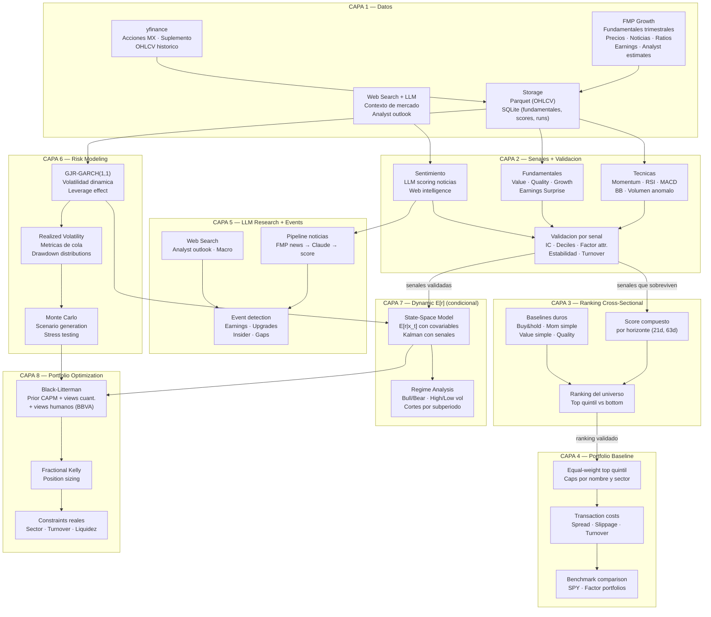
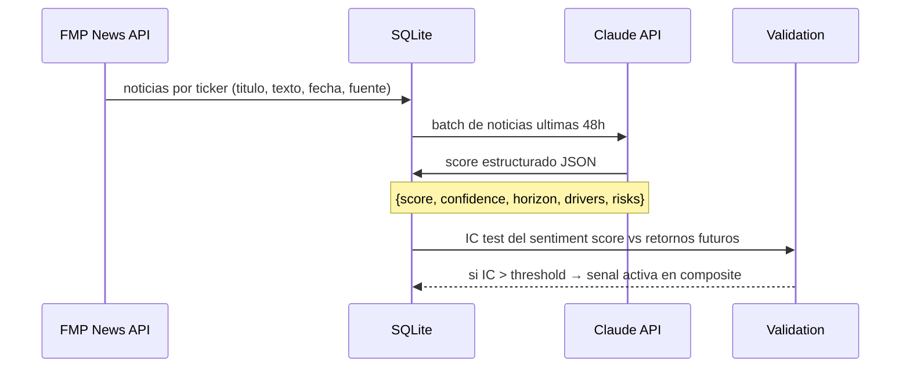

# Quantitative Investment System — Architecture v2

> Motor cuantitativo de expected returns condicionales + riesgo dinamico + portfolio optimization + validacion estricta.

---

## Tesis Central

La pregunta que este sistema intenta responder es concreta y falsable:

> **Dadas ciertas senales observables hoy, podemos rankear mejor que azar los retornos futuros de un universo de acciones, controlando por factores conocidos y costos de transaccion?**

No pretendemos predecir el precio de una accion. No pretendemos identificar "el drift verdadero" de un proceso estocastico. Pretendemos estimar una **distribucion condicional de retornos** dada informacion observable, y convertir esa estimacion en decisiones de inversion con riesgo explicito.

El horizonte es **inversion a mediano plazo** (semanas a meses). La ventaja competitiva no viene de un modelo sofisticado sino de **disciplina experimental rigurosa**: medir bien, validar bien, no autoengañarse.

---

## Principios de Diseño

1. **Falsabilidad primero**: cada componente del sistema debe ser testeable independientemente. Si una senal no muestra IC positivo out-of-sample, muere.

2. **Source-agnostic**: los modulos de analisis consumen DataFrames estandar. Cambiar FMP por Bloomberg no requiere reescribir analisis.

3. **Universe-agnostic**: cambiar de 25 tickers a S&P 500 es modificar un YAML.

4. **Reproducibilidad total**: cada run guarda snapshot con timestamp en SQLite. Podemos reproducir exactamente que senales tenia el sistema en cualquier fecha pasada.

5. **Incertidumbre explicita**: nunca predicciones puntuales. Siempre distribuciones y probabilidades.

6. **Validacion continua**: no existe una "fase de validacion" al final. Cada senal nace con su test. Ver `RESEARCH_PROTOCOL.md`.

---

## Vista General del Sistema



---

## Capa 1 — Datos

### Fuentes y responsabilidades

| Fuente | Datos | Frecuencia | Cobertura |
|--------|-------|-----------|-----------|
| **FMP Growth ($49/mo)** | Income stmt, Balance sheet, Cash flow, Ratios trimestrales, Earnings calendar/surprise, Analyst estimates, Noticias, Precios | Precios: diario · Fundamentales: trimestral · Noticias: diario | US completo |
| **yfinance** | OHLCV historico, splits, dividendos | Diario (suplemento) | Global (incl. BMV con `.MX`) |
| **Web Search + Claude API** | Sentiment de analistas, opinion retail, macro, earnings calls | Bajo demanda / diario para top tickers | Libre |

### Universo de monitoreo

```yaml
# universe.yaml
universes:
  watchlist:
    source: mixed
    tickers:
      us: [MSFT, META, AMZN, ASTS, RKLB, PLTR, MU, "ON", CX, NVDA, MRNA, CRM]
      mx: [PINFRA.MX, GFNORTEO.MX, WALMEX.MX]

  sp500:
    source: fmp
    auto_fetch: true          # FMP endpoint /sp500_constituent
    filters:
      min_market_cap: 2e9     # >$2B
      min_avg_volume: 500000  # >500K shares/day
    notes: "S&P 500 filtrado por liquidez — screener grueso"

active_universe: watchlist    # empezamos aqui, escalar a sp500 en Fase 3+
```

**Regla critica del universo**: el universo es parte del modelo. Debe definirse con:
- Market cap minimo (evitar microcaps)
- Volumen minimo (evitar iliquidez)
- Filtros de survivorship (no incluir acciones que ya no existen solo porque historicamente estaban)
- Point-in-time availability (usar la composicion del universo vigente en cada fecha, no la actual)

### Estrategia de almacenamiento

```
data/
  cache/           → Parquet: OHLCV por ticker (refresh diario, expiry 1d)
  db/
    market.db      → SQLite:
                      - fundamentals (trimestrales, con filing_date real)
                      - ratios (con timestamp de calculo)
                      - news (texto + score + timestamp de publicacion)
                      - signals (scores crudos por senal, por fecha, por ticker)
                      - rankings (snapshots diarios del ranking completo)
                      - runs (metadata de cada ejecucion del sistema)
```

**Timestamp real de disponibilidad**: para cada dato fundamental, guardamos la `filing_date` (cuando el dato se hizo publico), NO la `period_date` (a que trimestre corresponde). Esto es esencial para evitar look-ahead bias en backtesting.

---

## Capa 2 — Senales + Validacion Simultanea

### Principio fundamental

**Cada senal nace con su test.** No existe "implementar ahora, validar despues". El flujo es:

```
Hipotesis economica → Definicion exacta → Implementacion → Validacion → Pasa o muere
```

Ver `RESEARCH_PROTOCOL.md` para el protocolo completo.

### Senales Tecnicas

| Senal | Definicion | Horizonte natural | Hipotesis economica |
|-------|-----------|-------------------|---------------------|
| `momentum_12_1` | Retorno 12m menos retorno 1m | 21-63d | Momentum de mediano plazo con reversal de corto filtrado |
| `momentum_1m` | Retorno ultimo mes | 5-21d | Momentum de corto plazo |
| `rsi_14` | RSI 14 dias, normalizado a [-1, +1] | 5-21d | Mean reversion en sobrecompra/sobreventa |
| `macd_signal` | (MACD - Signal) / precio | 5-21d | Cambio de tendencia |
| `bb_position` | Posicion dentro de Bollinger Bands | 5-21d | Volatilidad relativa al rango |
| `vol_ratio` | Volumen actual / media 20d | 5-21d | Deteccion de interes institucional |

### Senales Fundamentales

| Senal | Definicion | Horizonte natural | Hipotesis economica |
|-------|-----------|-------------------|---------------------|
| `pe_relative` | P/E vs mediana sectorial, inverso | 63-252d | Value: activos baratos tienden a revertir |
| `ev_ebitda` | EV/EBITDA relativo al sector | 63-252d | Value |
| `fcf_yield` | FCF / Market Cap | 63-252d | Quality: empresas que generan cash |
| `roe` | Return on Equity | 63-252d | Quality: eficiencia de capital |
| `gross_margin_delta` | Cambio en margenes brutos YoY | 63-252d | Quality/Growth: mejora operativa |
| `earnings_surprise` | (actual - estimado) / abs(estimado) | 21-63d | Post-earnings drift (documentado en literatura) |
| `revenue_growth` | Crecimiento ingresos YoY | 63-252d | Growth |
| `debt_equity_inv` | Inverso de deuda/equity | 63-252d | Solvencia: menor apalancamiento = menor riesgo |

### Senales de Sentimiento (Fase 5)

| Senal | Definicion | Horizonte natural | Hipotesis economica |
|-------|-----------|-------------------|---------------------|
| `news_sentiment` | LLM scoring de noticias ultimas 48h | 5-21d | Informacion no procesada por el mercado |
| `web_sentiment` | LLM scoring de busqueda web | 5-63d | Consensus de analistas y retail |
| `event_flag` | Deteccion de evento material (earnings, upgrade, insider) | 1-5d | Evento cataliza movimiento |

### Validacion por senal

Cada senal se evalua con las siguientes metricas **antes de entrar al composite**:

```
IC (Information Coefficient):
  IC = rank_corr(senal_t, retorno_{t+h})
  IC > 0.03 → senal debil pero potencialmente util en composite
  IC > 0.05 → senal util
  IC > 0.10 → senal valiosa (raro)

Analisis por deciles:
  Dividir universo en 5-10 grupos por score
  ¿El top quintil supera al bottom? ¿Monotonicamente?

Factor attribution:
  ¿Cuanto del IC es explicado por market beta, size, value, momentum?
  ¿Hay IC residual despues de controlar factores?

Estabilidad:
  IC por subperiodo (anual)
  IC en bull vs bear markets
  IC en high vol vs low vol regimes

Turnover:
  ¿Cuanto cambia el ranking de un periodo al siguiente?
  Turnover > 200% anual puede destruir alpha por costos
```

---

## Capa 3 — Ranking Cross-Sectional

### El test central del sistema

La pregunta mas importante del proyecto entero:

> **¿El top quintil del ranking supera consistentemente al bottom quintil a 21 y 63 dias?**

Si la respuesta es no despues de multiple testing adjustment, el sistema no tiene senal predictiva util. Todo lo que se construya encima (GARCH, Kalman, Black-Litterman) solo seria decoracion de ruido.

### Score compuesto

```
score(ticker, t, horizonte) = Σ wᵢ · señal_i(ticker, t)

Pesos iniciales:     iguales (1/N senales sobrevivientes)
Pesos calibrados:    proporcionales a IC out-of-sample por senal
Separacion:          un composite para horizonte 21d, otro para 63d
```

### Baselines contra los que competir

El sistema no compite contra random. Compite contra:

| Baseline | Definicion | Por que es duro |
|----------|-----------|-----------------|
| Buy & Hold SPY | Comprar SPY y no hacer nada | Dificil de batir consistentemente |
| Momentum simple | Long top quintil por retorno 12-1m | Factor documentado, robusto |
| Value simple | Long top quintil por FCF yield o P/E inverso | Factor documentado |
| Quality simple | Long top quintil por ROE + bajos leverage | Factor documentado |
| Equal-weight combinacion | 1/3 momentum + 1/3 value + 1/3 quality | Combo basica de factores |

Si el composite no supera al menos algunos de estos baselines, no tenemos edge. Esto debe aceptarse con honestidad.

---

## Capa 4 — Portfolio Baseline

Antes de Black-Litterman, probar que el ranking se convierte en portafolio invertible:

```
Portafolio:        Equal-weight top quintil del ranking
Rebalanceo:        Mensual (21d) o trimestral (63d)
Caps:              Max 10% por nombre, max 30% por sector
Costos:            10 bps spread + 5 bps slippage por operacion
Benchmark:         SPY total return

Metricas:
  Sharpe ratio (annualizado)
  Max drawdown
  Calmar ratio (retorno / max drawdown)
  Hit rate mensual (% de meses con retorno positivo)
  Turnover anualizado
  Alpha de Jensen vs SPY
```

---

## Capa 5 — LLM Research + Event Intelligence

### Rol del LLM en el sistema

El LLM tiene valor en tres funciones con nivel de confianza decreciente:

1. **Research tool** (alta confianza): resumir, contextualizar, priorizar informacion
2. **Event detection** (media confianza): identificar eventos materiales, cambios de guidance, upgrades
3. **Senal predictiva** (por demostrar): que el sentiment score tenga IC positivo OOS

No asumimos que la senal de sentimiento tiene poder predictivo — lo medimos.

### Pipeline de noticias



**Versionado obligatorio**: cada score de LLM se guarda con:
- Timestamp del articulo (cuando se publico)
- Timestamp del scoring (cuando el LLM lo proceso)
- Modelo y version del LLM usado
- Version del prompt
- Texto original (para reproducibilidad)

### Web Search Intelligence

Busquedas web estructuradas via Claude con web search:
```
"[TICKER] analyst price target 2026"
"[TICKER] earnings outlook Q[N]"
"[TICKER] investor sentiment risk"
```

Mismo pipeline: texto → LLM → score estructurado → validacion.

---

## Capa 6 — Risk Modeling

### GJR-GARCH(1,1) para volatilidad dinamica

```
σ²_t = ω + (α + γ · 1_{ε_{t-1}<0}) · ε²_{t-1} + β · σ²_{t-1}
```

- Captura volatility clustering
- γ > 0 captura leverage effect (caidas → mas volatilidad)
- Forecast de σ(t) a 5-21 dias es bastante bueno empiricamente
- Implementacion via `arch` library en Python

**Uso principal**: no alpha, sino gestion de riesgo:
- Position sizing: inversamente proporcional a σ(t)
- Ajuste de exposicion: reducir en regimenes de alta volatilidad
- Input para Monte Carlo y VaR dinamico

### Monte Carlo como herramienta de riesgo

Simulacion de N=10,000 trayectorias para **scenario analysis**, no para prediccion:

```
S_{t+Δt} = S_t · exp[(μ̂ - ½σ²(t))Δt + σ(t)√Δt · Z]    Z ~ N(0,1)
```

donde:
- σ(t) viene de GARCH forecast
- μ̂ viene del score compuesto traducido a expected return

Output: distribucion completa → P(ganancia > X%), VaR, CVaR, drawdown esperado.

**El Monte Carlo es capa de interpretacion de riesgo, no fuente del alpha.**

### Regime analysis

Cortar todos los resultados por:
- Bull / Bear (retorno 12m del benchmark > 0 o < 0)
- High vol / Low vol (VIX o σ_GARCH del benchmark)
- Rising / Falling rates (pendiente yield curve)

Porque muchas senales funcionan solo en ciertos regimenes.

---

## Capa 7 — Dynamic Expected Return Modeling

### Prerrequisito

Esta capa solo se construye si:
1. Las senales de Capa 2 muestran IC positivo OOS
2. El ranking de Capa 3 supera baselines
3. El portfolio de Capa 4 sobrevive costos de transaccion

Si esas condiciones no se cumplen, agregar complejidad solo maquilla un sistema debil.

### Modelo de retorno condicional

```
r_{i, t→t+h} = α(x_{i,t}) + β_i' · F_{t→t+h} + ε_{i,t+h}
```

donde:
- `x_{i,t}` son las senales validadas de Capa 2
- `F` son factores de mercado (market, size, value, momentum, quality)
- `α(·)` es el expected return condicional que queremos estimar
- `ε` es el residual no predecible

### State-space con covariables (Kalman reformulado)

Si se justifica por evidencia empirica:

```
Estado:        E[r_t | x_t] = β_t' · x_t + u_t        (coeficientes time-varying)
Transicion:    β_t = β_{t-1} + η_t                      (evolucion lenta)
Observacion:   r_t = β_t' · x_t + σ_t · ε_t             (retorno observado)
```

Esto es un Kalman con covariables — no un drift latente caminando solo. Los coeficientes β_t capturan cuanto pesa cada senal en cada momento, y se adaptan.

**Solo entra si mejora sobre el composite estatico de Capa 3 en test OOS.**

---

## Capa 8 — Portfolio Optimization

### Black-Litterman

Combina prior de mercado con views cuantitativos y humanos:

```
Prior:      Π = δ · Σ · w_mkt                         (retornos de equilibrio CAPM)
Views:      q = E[r | x_t] por accion                  (del composite o Kalman)
Confianza:  Ω = diag(1/confidence_i)                   (inverso de confianza)

Posterior:  μ_BL = [(τΣ)⁻¹ + P'Ω⁻¹P]⁻¹ · [(τΣ)⁻¹Π + P'Ω⁻¹q]
```

Los views del socio BBVA (analisis fundamental humano) se integran como views adicionales con confianza explicita.

### Position Sizing — Fractional Kelly

```
f* = (μ̂ - r_f) / σ²    →    uso: f*/2 (fractional Kelly)
```

donde μ̂ y σ² vienen del composite + GARCH.

### Constraints reales

- Max 10% por nombre individual
- Max 30% por sector
- Turnover cap: max 100% anualizado (ida y vuelta)
- Liquidez: solo acciones con >$1M volumen diario promedio
- Beta target: configurable (1.0 para neutral, <1 para defensivo)

---

## Peligros Metodologicos

Documentados explicitamente porque en quant, media ventaja competitiva es no engañarse:

| Peligro | Descripcion | Mitigacion |
|---------|-----------|------------|
| **Look-ahead bias** | Usar informacion que no estaba disponible en la fecha simulada | Guardar `filing_date` real de cada dato. Solo usar datos con `filing_date < fecha_simulacion` |
| **Survivorship bias** | Universo actual excluye empresas que quebraron/delistaron | Usar universo point-in-time (composicion vigente en cada fecha) |
| **Data snooping** | Probar muchas senales y reportar solo las que funcionan | Multiple testing adjustment (Bonferroni o FDR). Research protocol estricto |
| **Overfitting** | Modelo se ajusta a ruido historico, no a senal real | Train/test split temporal estricto. Walk-forward validation |
| **Publication lag** | Fundamentales reportados semanas/meses despues del periodo | Usar `filing_date`, no `period_date`. Asumir lag conservador |
| **Leakage en sentimiento** | LLM tiene informacion del futuro en su training data | Solo usar noticias con timestamp verificable. No backtestear sentimiento antes de la fecha de disponibilidad del modelo |
| **Transaction costs** | Alpha desaparece al incluir spread, slippage, turnover | Simular 10-15 bps por lado desde el dia 1. Penalizar turnover |
| **Corporate actions** | Splits, dividendos, mergers distorsionan retornos | Usar precios adjusted. Verificar fuente de ajuste |

---

## Stack Tecnologico

```
Datos          : requests (FMP REST API), yfinance, anthropic SDK
Storage        : pandas + parquet (series), SQLite (estructurado)
Senales        : pandas, numpy, pandas-ta (indicadores tecnicos)
Estadistica    : scipy, statsmodels, arch (GARCH)
State-Space    : filterpy o implementacion propia (numpy)
Optimizacion   : cvxpy (convex), scipy.optimize
Simulacion     : numpy vectorizado (Monte Carlo)
Visualizacion  : matplotlib, plotly
Scheduling     : cron / APScheduler
Config         : PyYAML
```

---

## Estructura de Archivos (objetivo)

```
finance-portfolio/
│
├── ARCHITECTURE.md              ← este documento
├── ROADMAP.md                   ← plan de 8 fases
├── RESEARCH_PROTOCOL.md         ← protocolo de validacion de senales
│
├── config/
│   ├── portfolio.yaml           ← portafolios y parametros de analisis
│   └── universe.yaml            ← universo de monitoreo
│
├── data/
│   ├── cache/                   ← parquet: OHLCV por ticker
│   ├── db/
│   │   └── market.db            ← SQLite: todo lo estructurado
│   └── historical/              ← snapshots historicos
│
├── src/
│   ├── data/
│   │   ├── fetcher.py           ← yfinance (ya existe)
│   │   ├── fmp_client.py        ← FMP REST API client
│   │   ├── universe.py          ← gestion del universo
│   │   └── database.py          ← SQLite schema + queries
│   │
│   ├── signals/
│   │   ├── technical.py         ← MACD, RSI, momentum, BB, volumen
│   │   ├── fundamental.py       ← ratios, earnings surprise, calidad
│   │   └── sentiment.py         ← pipeline noticias + web → LLM → score
│   │
│   ├── validation/
│   │   ├── signal_tester.py     ← IC, deciles, factor attribution
│   │   ├── baselines.py         ← buy&hold, momentum, value, quality
│   │   └── backtest.py          ← walk-forward, regime splits
│   │
│   ├── risk/
│   │   ├── garch.py             ← GJR-GARCH fit + forecast
│   │   ├── montecarlo.py        ← simulacion + metricas de riesgo
│   │   └── regime.py            ← clasificacion de regimenes
│   │
│   ├── models/
│   │   └── state_space.py       ← Kalman con covariables (Fase 7)
│   │
│   ├── portfolio/
│   │   ├── black_litterman.py   ← BL model
│   │   ├── optimization.py      ← ya existe, expandir
│   │   └── kelly.py             ← position sizing
│   │
│   ├── screener/
│   │   ├── scorer.py            ← score compuesto por horizonte
│   │   └── ranker.py            ← ranking + alertas
│   │
│   ├── analysis/                ← ya existe (Fase 0)
│   │   ├── portfolio.py
│   │   ├── risk.py
│   │   └── optimization.py
│   │
│   └── utils/
│       ├── config.py            ← ya existe
│       ├── reporting.py         ← ya existe
│       └── scheduler.py         ← runs diarios
│
├── notebooks/
│   ├── 01_portfolio_explorer.ipynb     ← ya existe
│   ├── 02_signal_validation.ipynb      ← IC, deciles, factor analysis
│   ├── 03_screener_dashboard.ipynb     ← ranking interactivo
│   ├── 04_risk_analysis.ipynb          ← GARCH + MC + scenarios
│   └── 05_portfolio_optimizer.ipynb    ← BL + pesos + constraints
│
├── reports/
├── requirements.txt
└── run_analysis.py

```

---

## Dos Potenciales del Proyecto

### Potencial 1: Research Engine (alcanzable, alto valor)

Un sistema que industrialice ingestion de datos, scoring, monitoreo, research asistido, ranking y alertas ya tiene valor enorme para:
- Cartera personal
- Apoyo a asesores de wealth management
- Family offices
- Equipos pequeños de inversion

**Este potencial es real y relativamente cercano.**

### Potencial 2: Alpha Explotable (posible, estandar altisimo)

Un fondo cuantitativo basado en senales validadas con track record. Posible, pero el cuello de botella no es matematico sino:
- Calidad de datos
- Disciplina de backtesting
- Execution frictions
- Paciencia para matar ideas que no funcionan
- Años de track record

**Este potencial existe, pero requiere que Potencial 1 funcione primero.**

### Ventaja del mercado mexicano

La BMV es menos eficiente que NYSE/NASDAQ: menos cobertura de analistas, menos capital cuant, menos sofisticacion. La competencia no es Renaissance Technologies — son analistas de Excel en bancos locales. La barra es mas baja de lo que parece, y la combinacion perfil matematico + perfil financiero con network en banca es genuinamente diferenciada.
