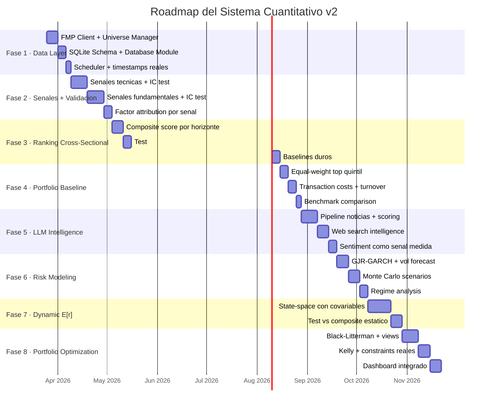

# Roadmap de Desarrollo v2

> Plan de 8 fases con validacion integrada desde el dia 1.
> Cada fase produce valor independiente. Las fases avanzadas solo se construyen si las anteriores demuestran senal real.

---

## Principio rector

> El verdadero exito de este proyecto no va a venir de tener el modelo mas sofisticado, sino de tener la mejor disciplina experimental. En quant, muchas veces gana el que mejor mide, no el que mas ecuaciones escribe.

---

## Resumen de Fases



---

## Fase 1 — Data Layer

**Objetivo**: sistema que descarga, cachea y sirve datos de cualquier ticker del universo con timestamps reales de disponibilidad.

**Entregables**:
- `src/data/fmp_client.py` — cliente REST para FMP Growth API
- `config/universe.yaml` — definicion del universo (watchlist, sp500, mx)
- `src/data/universe.py` — carga y gestiona el universo activo
- `src/data/database.py` — SQLite schema con `filing_date` real en fundamentales
- `src/utils/scheduler.py` — runs diarios automaticos

**Criterio de exito**:
```python
client = FMPClient(api_key="...")
db = MarketDB("data/db/market.db")

# Fundamentales trimestrales con filing_date real
income = client.get_income_statement("MSFT", period="quarterly", limit=8)
assert "fillingDate" in income[0]  # FMP lo llama fillingDate

# Cacheado en SQLite, rapido
db.get_latest_fundamentals("MSFT")  # < 10ms
```

**Gate para avanzar**: datos disponibles y confiables para todo el universo activo.

---

## Fase 2 — Senales + Validacion Simultanea

**Objetivo**: implementar senales tecnicas y fundamentales. Cada una con test de IC, deciles y factor attribution inmediatamente.

**Entregables**:
- `src/signals/technical.py` — momentum_12_1, momentum_1m, RSI, MACD, BB, vol_ratio
- `src/signals/fundamental.py` — pe_relative, ev_ebitda, fcf_yield, roe, earnings_surprise, revenue_growth, gross_margin_delta, debt_equity_inv
- `src/validation/signal_tester.py` — IC, decil analysis, estabilidad, turnover
- `src/validation/baselines.py` — factor portfolios simples para attribution
- `notebooks/02_signal_validation.ipynb` — reporte visual de cada senal

**Metricas por senal** (ver `RESEARCH_PROTOCOL.md`):

```
senal: momentum_12_1
  horizonte: 21d
  IC:                 0.062  ✓ (> 0.03)
  IC (bull market):   0.078
  IC (bear market):   0.031
  top quintil - bottom quintil (annualized): +8.2%
  monotonia deciles:  4/5 ordenados  ✓
  factor residual IC: 0.028 (despues de controlar market + value)
  turnover mensual:   35%
  VEREDICTO:          PASA → entra al composite
```

**Gate para avanzar**: al menos 3-5 senales con IC > 0.03 OOS y factor residual positivo.

**Si no pasa el gate**: revisar definiciones, horizontes, universo. Si despues de ajustes sigue sin senal, revaluar todo el enfoque antes de agregar complejidad.

---

## Fase 3 — Ranking Cross-Sectional

**Objetivo**: combinar senales sobrevivientes en score compuesto y probar poder predictivo cross-sectional.

**Entregables**:
- `src/screener/scorer.py` — composite score por horizonte (21d, 63d)
- `src/screener/ranker.py` — ranking del universo
- Comparacion contra baselines duros

**El test definitivo**:

```
Cross-sectional test (horizonte 21d):
  Universo: 50+ acciones con datos completos
  Periodo OOS: minimo 2 anos
  Rebalanceo: mensual

  Resultados:
    Top quintil retorno annualizado:    +18.3%
    Bottom quintil retorno annualizado: +6.1%
    Spread (long top / short bottom):   +12.2%
    t-stat del spread:                  2.41 (p < 0.05)

  Baselines:
    Buy & Hold SPY:                     +11.2%
    Momentum simple (12-1m):            +14.1%
    Value simple (FCF yield):           +10.8%
    Composite > momentum simple?        SI ✓
```

**Gate para avanzar**: spread top-bottom significativo (t > 2.0) y composite supera al menos 2 de 4 baselines.

---

## Fase 4 — Portfolio Baseline

**Objetivo**: convertir ranking en portafolio invertible con costos reales.

**Entregables**:
- Portafolio equal-weight top quintil con caps
- Simulacion con costos (10-15 bps por lado)
- Comparacion vs SPY total return

**Metricas**:
```
Portfolio baseline (top quintil, EW, rebalanceo mensual):
  Retorno annualizado:     +15.1%
  Volatilidad annualizada: 18.2%
  Sharpe ratio:            0.61
  Max drawdown:            -22.4%
  Calmar ratio:            0.67
  Turnover annualizado:    145%
  Costo total estimado:    -2.1% annualizado
  Retorno neto:            +13.0%

  vs SPY:
    SPY Sharpe:            0.52
    Alpha de Jensen:       +3.8% (t = 1.9)
```

**Gate para avanzar**: Sharpe neto (despues de costos) > Sharpe de SPY. Si no, optimizar turnover y costos antes de agregar complejidad.

---

## Fase 5 — LLM Research + Event Intelligence

**Objetivo**: agregar capa de inteligencia con LLM. Sentimiento como senal medida, no asumida.

**Entregables**:
- `src/signals/sentiment.py` — pipeline: FMP noticias → Claude API → score JSON
- Web Search intelligence via Claude
- `src/validation/signal_tester.py` — IC test para sentiment scores
- Versionado completo: texto original, timestamp, modelo, prompt version

**Rol del LLM** (en orden de confianza):
1. Research tool: resumir, contextualizar, priorizar (alta confianza)
2. Event detection: earnings, upgrades, insider, gaps (media confianza)
3. Senal predictiva: sentiment score con IC medido (por demostrar)

**Gate para avanzar**: pipeline funcional. Si sentiment muestra IC > 0.03, entra al composite. Si no, sigue como research tool (que ya tiene valor).

---

## Fase 6 — Risk Modeling

**Objetivo**: modelar volatilidad dinamica para position sizing y scenario analysis.

**Entregables**:
- `src/risk/garch.py` — GJR-GARCH(1,1) fit + forecast via `arch` library
- `src/risk/montecarlo.py` — simulacion Euler-Maruyama vectorizada
- `src/risk/regime.py` — clasificacion bull/bear, high/low vol
- `notebooks/04_risk_analysis.ipynb` — GARCH fit, MC distributions, fan charts

**Uso principal** (riesgo, no alpha):
- Position sizing inversamente proporcional a σ(t) forecast
- VaR/CVaR dinamicos (mejores que estaticos)
- Stress testing: ¿que pasa si σ sube 2x?
- Regime-conditional analysis de las senales de Fase 2

**Validacion**: σ_GARCH forecast vs realized vol a 5, 10, 21 dias. GARCH deberia tener RMSE significativamente menor que volatilidad historica constante.

---

## Fase 7 — Dynamic Expected Return Modeling

**Prerrequisito estricto**: Fases 2-4 demuestran senal predictiva neta de costos.

**Objetivo**: probar si un modelo dinamico de E[r|x_t] mejora sobre el composite estatico.

**Entregables**:
- `src/models/state_space.py` — Kalman con covariables (senales como regressors)
- Test: ¿state-space > composite estatico en IC OOS?

**Modelo**:
```
β_t = β_{t-1} + η_t                    (coeficientes evolucionan lentamente)
r_t = β_t' · x_t + σ_t · ε_t           (retorno = f(senales) + ruido)
```

donde x_t son las senales validadas y σ_t viene de GARCH.

**Gate**: solo se adopta si IC del state-space > IC del composite estatico por > 0.01 en test OOS de al menos 1 ano.

---

## Fase 8 — Portfolio Optimization

**Objetivo**: portfolio construction sofisticado con views cuantitativos y humanos.

**Entregables**:
- `src/portfolio/black_litterman.py` — BL con views del sistema + views BBVA
- `src/portfolio/kelly.py` — fractional Kelly position sizing
- Constraints reales: sector, turnover, liquidez, beta target
- `notebooks/05_portfolio_optimizer.ipynb` — dashboard integrado

**Black-Litterman**:
```
Prior:     Π = δ · Σ · w_mkt          (equilibrio CAPM)
Views:     q = E[r|x_t]               (del composite o state-space)
Confianza: Ω = f(IC, confianza)       (inverso de incertidumbre)

Views humanos del socio BBVA se integran como views adicionales
con nivel de confianza explicito
```

---

## Fase X — Vision de Largo Plazo

Condicionado a que Fases 1-8 funcionen y produzcan track record:

1. **Expansion a S&P 500 completo** como universo del screener
2. **Modelos de cola**: EVT, Jump-Diffusion para eventos extremos
3. **Regime switching formal**: HMM / Bayesian regime switching
4. **Cobertura BMV completa**: ventaja por menor competencia cuant en Mexico
5. **Track record documentado**: 2+ anos → base para vehiculo de inversion formal

---

## Estado Actual

```
✅ Fase 0  — Infraestructura base
             yfinance fetcher + cache parquet
             Portfolio analysis (retornos, correlaciones)
             VaR/CVaR estatico
             Optimizacion Markowitz basica
             Notebook explorador

⏳ Fase 1  — Data Layer (SIGUIENTE)
             FMP Client
             Universe Manager
             SQLite Database

⬜ Fase 2  — Senales + Validacion
⬜ Fase 3  — Ranking Cross-Sectional
⬜ Fase 4  — Portfolio Baseline
⬜ Fase 5  — LLM Intelligence
⬜ Fase 6  — Risk Modeling
⬜ Fase 7  — Dynamic E[r] (condicional a Fases 2-4)
⬜ Fase 8  — Portfolio Optimization
```
